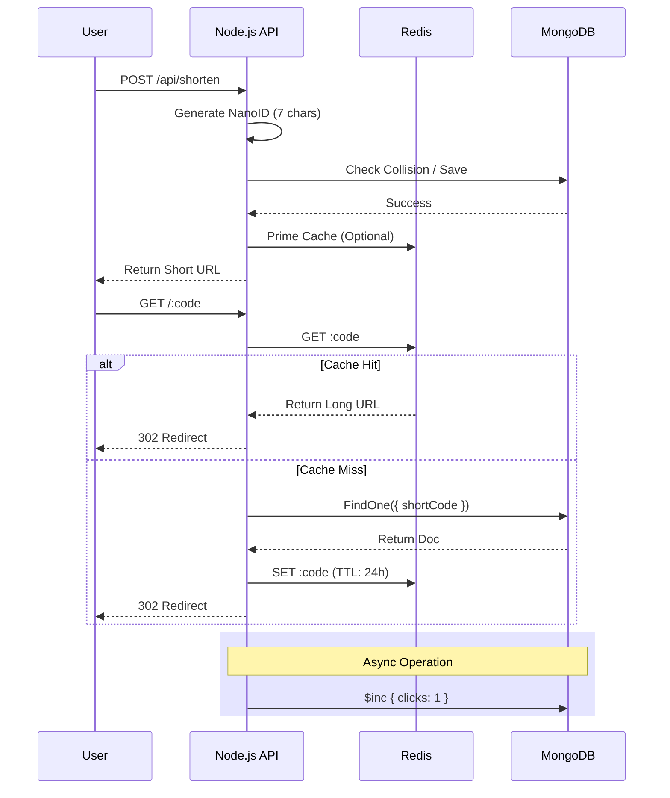

# Technical Design Document: URL Shortener Service

## 1. Executive Summary
This document outlines the technical architecture, design decisions, and implementation details of the URL Shortener Service. The service is designed to be a lightweight, high-performance, and scalable solution for converting long URLs into short, shareable links, with built-in analytics and redirect capabilities.

## 2. System Architecture

### 2.1 High-Level Design
The system follows a standard **N-Tier Architecture**:
1.  **Presentation Layer**: Simple HTML/JS Frontend (for demonstration).
2.  **Application Layer**: Node.js/Express REST API.
3.  **Data Layer**:
    *   **Primary Store**: MongoDB (Persistent data).
    *   **Cache Store**: Redis (High-speed read access).

### 2.2 detailed Workflow

## 3. Technology Stack & Rationale

| Component | Technology | Rationale |
| :--- | :--- | :--- |
| **Runtime** | **Node.js (v16+)** | Event-driven, non-blocking I/O ideal for high-concurrency network applications (I/O bound). Native ES Module support. |
| **Framework** | **Express.js** | Minimalist, unopinionated web framework with a vast ecosystem of middleware (Helmet, CORS, Rate Limit). |
| **Database** | **MongoDB** | Flexible schema, high write throughput, and easy horizontal scaling (Sharding). Mongoose provides strict schema validation. |
| **Caching** | **Redis** | In-memory key-value store providing sub-millisecond response times for redirects. Essential for reading scaling. |
| **ID Generation** | **NanoID** | Cryptographically secure, URL-friendly, and more compact/collision-resistant than UUIDs. |
| **Containerization**| **Docker** | Ensures consistent environments across development, testing, and production. |

## 4. Data Design

### 4.1 Schema (MongoDB)
**Collection**: `urls`

| Field | Type | Required | Unique | Indexed | Description |
| :--- | :--- | :--- | :--- | :--- | :--- |
| `_id` | ObjectId | Yes | Yes | Yes | Primary Key |
| `shortCode` | String | Yes | Yes | **Yes** | The 7-character unique ID (e.g., `Xy7z9A1`). |
| `longUrl` | String | Yes | No | No | The original destination URL. |
| `clicks` | Number | Yes | No | No | Counter for analytics. Defaults to 0. |
| `lastAccessed`| Date | No | No | No | Timestamp of the last redirect. |
| `createdAt` | Date | Yes | No | No | Record creation timestamp. |

### 4.2 Caching Strategy (Redis)
-   **Pattern**: Cache-Aside (Lazy Loading).
-   **Key Format**: Plain `shortCode` string.
-   **Value**: Plain `longUrl` string.
-   **TTL**: 24 Hours (86400 seconds).
-   **Rationale**: Most links are accessed frequently shortly after creation, then traffic drops off. TTL ensures memory is not wasted on stale links.

## 5. API Specification

### 5.1 Endpoints
*   **POST** `/api/shorten`
    *   Creates a new short URL.
    *   **Body**: `{ "longUrl": "https://..." }`
    *   **Response**: `201 Created` with `{ "shortCode": "...", "shortUrl": "..." }`
*   **GET** `/:code`
    *   Redirects to the original URL.
    *   **Response**: `302 Found` (Location Header) or `404 Not Found`.
*   **GET** `/api/info/:code`
    *   Retrieves metadata and stats.
    *   **Response**: `200 OK` with JSON object.
*   **GET** `/ping` / `/health`
    *   Service health checks.

## 6. Security & Performance

### 6.1 Security Measures
-   **Helmet**: Sets secure HTTP headers (HSTS, X-Frame-Options, etc.).
-   **Rate Limiting**: Limits requests per IP (100 req / 15 min) to prevent abuse/DDoS.
-   **Input Validation**: Checks for valid URL format before processing.
-   **CORS**: Configured to allow cross-origin requests (can be restricted for specific domains).

### 6.2 Scalability
-   **Stateless API**: The Node.js application holds no state. It can be horizontally scaled behind a Load Balancer (Nginx/AWS ELB).
-   **Database**: MongoDB can be deployed as a Replica Set for high availability or Sharded Cluster for write scaling.
-   **Cache**: Redis Cluster can be used if the cache dataset exceeds single-node memory.

## 7. Future Roadmap
-   [ ] **User Accounts**: Allow users to manage their links.
-   [ ] **Custom Aliases**: Allow users to pick their own short codes (e.g., `/my-product`).
-   [ ] **Advanced Analytics**: Track Geo-location, User-Agent, and Referrer.
-   [ ] **Expiration**: Auto-expire links after a set date.
